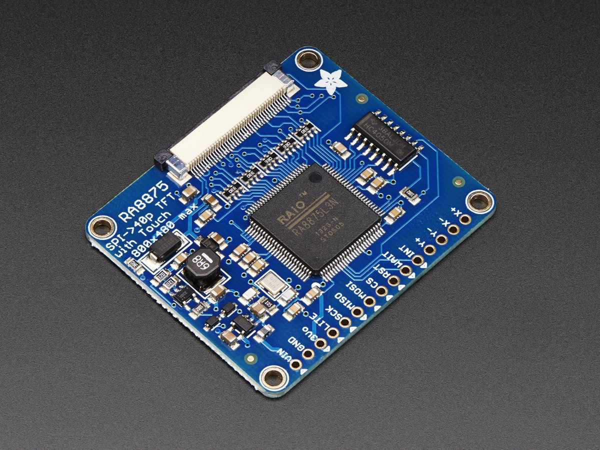

# Adafruit's Arduino driver for the RA8875 TFT driver 

This is a library for our driver board 40-pin TFT Touch Displays - 800x480 Max

Pick one up today in the adafruit shop!
  * https://www.adafruit.com/products/1590

The RA8875 is a TFT driver for up to 800x480 dotclock'd displays
It is tested to work with displays in the Adafruit shop. 
Other displays may need timing adjustments and are not guanteed to work.

Adafruit invests time and resources providing this open source code, please support Adafruit and open-source hardware by purchasing products from Adafruit!

Written by Limor Fried/Ladyada  for Adafruit Industries. BSD license, check license.txt for more information. 

All text above must be included in any redistribution
